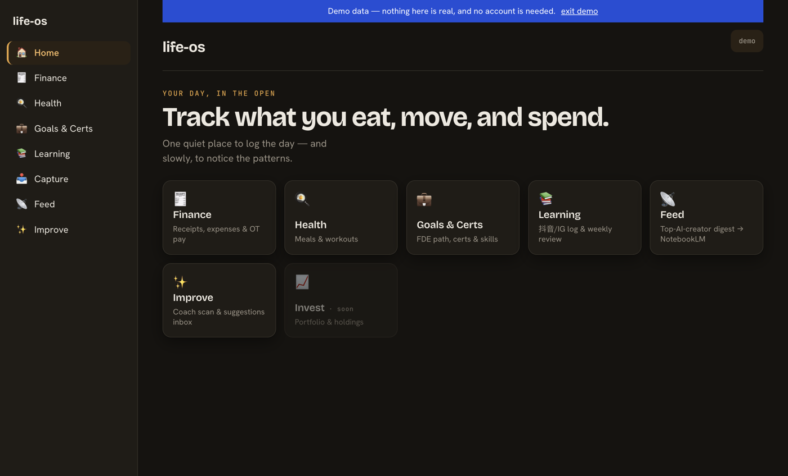
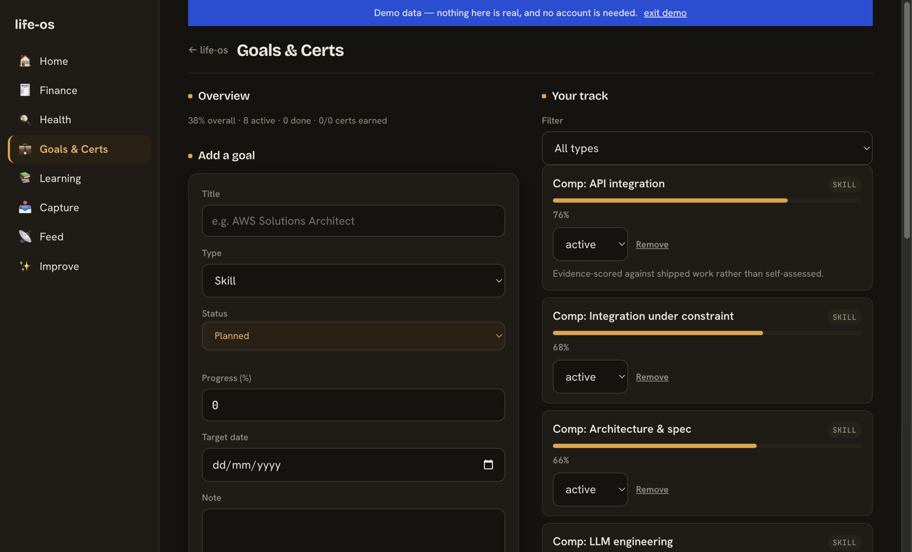
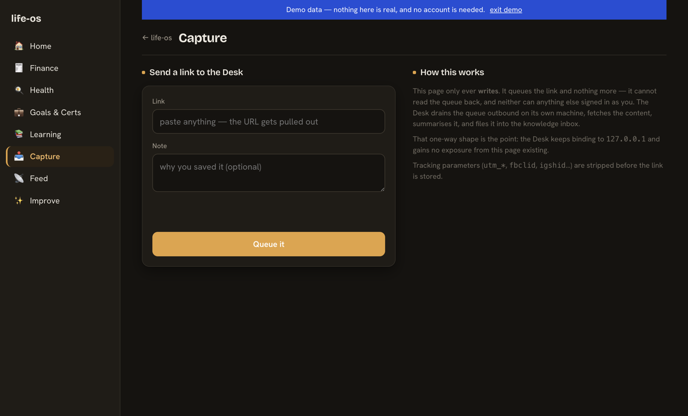

# life-os

A personal, offline-first **life dashboard** — track spending, meals, workouts,
learning, and career goals in one installable PWA. Built with **no framework and no
build step**: vanilla ES-module JavaScript on a Supabase (Postgres) backend, with
AI features powered by Claude vision.

I built it to solve my own problem, and to keep a single, focused codebase where I
could practice the full path from schema → row-level security → edge functions →
tested UI, without a framework hiding the moving parts.

### ▶ [Open the live demo](https://weng-yong-aipm.github.io/life-os/?demo=1) — no sign-up, no credentials

The `?demo=1` flag renders invented fixture data. It is safe by construction rather
than by care: in demo mode `getClient()` returns `null`, so the Supabase client is
never built and no real row can be fetched. Writes fail on the null client, which
makes the demo read-only for free.

| Home | Goals & Certs | Capture |
| --- | --- | --- |
|  |  |  |

**Stack:** vanilla JS PWA · Supabase (Postgres + RLS + Storage + Edge Functions/Deno) · Claude vision · Node test runner

## What it demonstrates

- **Multi-tenant data security done properly.** Every table is protected by Postgres
  **Row-Level Security** so each user can only read/write their own rows
  (`auth.uid() = user_id`); Storage buckets are folder-scoped per user. See
  [`supabase/schema.sql`](supabase/schema.sql).
- **AI product features, not demos.** Snap a receipt or a meal photo → a Deno **edge
  function** calls Claude vision → returns structured JSON (line items, macros) into
  an editable review step before it's saved. See
  [`supabase/functions/`](supabase/functions/).
- **A clean module pattern that scales.** Each feature is `index.html` + a pure-logic
  `.js` (unit-tested with the Node test runner) + a thin `*-repo.js` data layer over a
  shared `db.js`. Pay math, nutrition, calorie-burn, and ISO-week rollups are all
  covered by fast, dependency-free tests (`npm test`).
- **Offline-first PWA.** A network-first service worker keeps the app usable offline
  and fresh online; food/exercise datasets are bundled so search + portion math work
  with no connection.
- **A deliberate design system.** A hand-built, theme-aware ("Daybook") token system —
  light/dark, responsive two-pane→single-column — in one `ui.css`, no UI library.

## Modules

| Module | What it does |
| --- | --- |
| **Finance** | Receipt scanning (Claude vision), manual expenses, and a Malaysia-aware OT pay calculator |
| **Health** | Meal logging (photo estimate or offline food search + portion math) and workout tracking with MET-based calorie burn |
| **Learning** | Logs learning sessions (抖音/IG → project → applied/rejected) with a weekly ISO-week review |
| **Goals & Certs** | An FDE/AI-PM career tracker: roles, income targets, certs, and skills with progress bars |
| **Capture** | Queue a link from your phone for the local knowledge pipeline to fetch. Insert-only by design — see below |
| Invest | *planned* |

### Capture: a write-only queue

The Capture module exists to let a phone hand a URL to a machine that is **not**
reachable from the internet. `capture_queue` has an insert policy and nothing
else — no select, update, or delete policy for signed-in users — so the page can
add to the queue and can never read it back. A local worker drains it outbound
with the service-role key.

That asymmetry is the point: a stolen session can put junk in the queue and cannot
learn anything from it, and the machine doing the fetching never opens a port.
Verified against the live database with a row present — service-role reads it,
`anon` reads zero. See
[`supabase/migrations/20260803150000_add_capture_queue.sql`](supabase/migrations/20260803150000_add_capture_queue.sql).

## Setup

1. Create a new Supabase project (separate from any other personal project).
2. Project Settings -> API: copy the Project URL and `anon` key into `config.js`.
3. Copy `.env.example` to `.env` and fill in `SUPABASE_URL`, `SUPABASE_ANON_KEY`,
   `SUPABASE_SERVICE_ROLE_KEY`, `SUPABASE_DB_PASSWORD`, `ANTHROPIC_API_KEY`.
4. Supabase SQL Editor: run `supabase/schema.sql`.
5. Install the Supabase CLI (`brew install supabase/tap/supabase`), `supabase login`,
   `supabase link --project-ref <ref>`.
6. `supabase secrets set ANTHROPIC_API_KEY=<your key>`
7. `supabase functions deploy parse-receipt && supabase functions deploy estimate-meal`
8. Serve locally: `python3 -m http.server 8080`, open `http://localhost:8080`.

## Tests

`npm test` runs the pure-logic unit tests (pay calculation, day classification,
holiday lookup). UI flows (receipt scan, OT pay entry) are verified manually
against the running app — see the plan doc for the exact checklist.

## Health module

Meal and workout tracking. Food and exercise data are bundled offline in
`health/data/` (`foods.json` is hand-curated; `exercises.json` is derived from the
public-domain [yuhonas/free-exercise-db](https://github.com/yuhonas/free-exercise-db)).
Meal photos are estimated by the `estimate-meal` edge function (same
Claude / `ANTHROPIC_API_KEY` setup as receipts). Search + portion math + burn
estimate work offline; saving requires Supabase sign-in.

## Updating Malaysia public holidays

`finance/malaysia-holidays.js` is a static list, not a live API (Malaysia isn't
covered by the free public-holiday APIs checked during planning). Add a new
`MALAYSIA_HOLIDAYS_<year>` array every December and spread it into `ALL_HOLIDAYS`.
